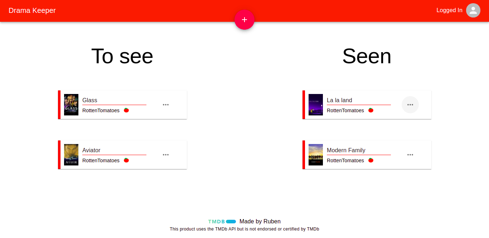
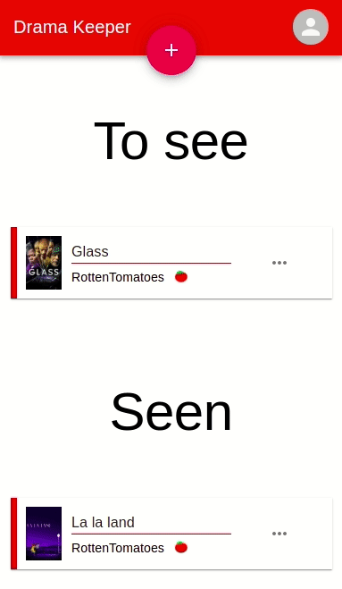
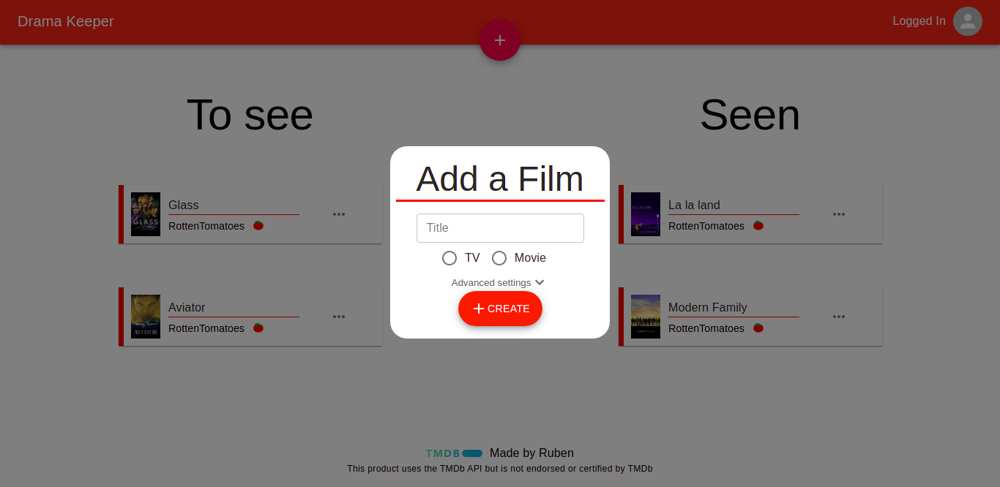
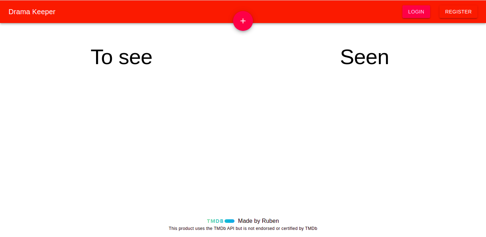

# Drama Keeper

Keep a record of the films watched


## Goals

- [x] Integrate a backend with a frontend
- [x] Learn TypeScript
- [x] Deploy a Fullstack app
- [x] Learn React
- [x] Use my custom hooks in react
- [x] Use react context
- [x] Integrate a third-party API

## About the project

In Drama Keeper you can create an account and have a database to save the films you want to see and the ones you already watched.

The server uses the [TMDb API](https://www.themoviedb.org/) to get film poster image.

> Any image is saved in the DB. Only the poster path.

## Screenshots





## Tech used

* [Node.js](https://nodejs.dev/)
* [Express](https://expressjs.com/) - For the server
* [MongoDB](https://www.mongodb.com/) - For the database
* [TypeScript](https://www.typescriptlang.org/) - For the strong typing
* [React](https://reactjs.org/) - For the frontend
* [Material UI](https://material-ui.com/) - To make it cute

## Build the app by yourself

### What you need before

- Node.js
- Yarn
- A [MongoDB](https://www.mongodb.com/) database
- A [TMDb API Key](https://developers.themoviedb.org/3/getting-started/introduction)

### Steps

1. Clone this repository
2. With terminal project root folder, to install dependencies run:
```
$ yarn && cd client && yarn
```
3. Rename the file `.env.example` to `.env` and fill it.
4. **Run the app:**
```
$ yarn dev
```
This runs
```
concurrently \"yarn start\" \"cd client/ && yarn start\"
```

The app should run ok.

## Contact me!

- Email: ruben.pardes25@gmail.com

## Attribution

For the film posters, [TMDb](https://www.themoviedb.org/) is used.